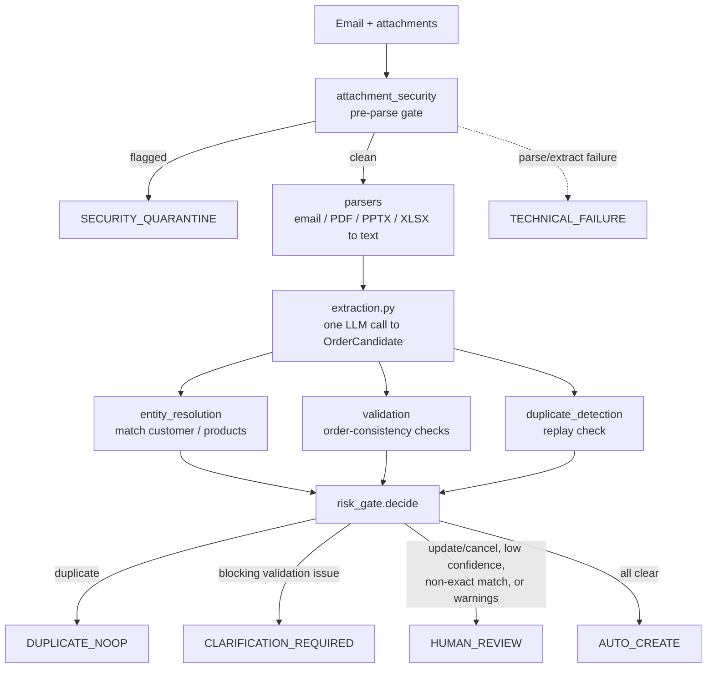

# Email-to-ERP Agentic Workflow

[](https://github.com/BigEyesDev/ERPAgent/actions/workflows/tests.yml)

Converts unstructured customer order emails (and their PDF, PPTX, and XLSX
attachments) into validated ERP orders, keeping the process safe, auditable,
and controllable. A single email inbox is assumed; the ERP is reached through
a REST-shaped client that can read master data and create, update, or cancel
orders.

The walkthrough lives in [notebook/email_to_erp.ipynb](notebook/email_to_erp.ipynb),
which imports and runs the modules in `src/` rather than re-implementing any
logic inline. The same code is unit-tested under `tests/`.

## Results

Measured by `evaluation/evaluate_workflow.py` against 26 fixtures covering
clean orders, ambiguous/incomplete data, prompt injection, malformed and
encrypted attachments, and duplicate/replayed messages:

| Metric | Value |
| --- | --- |
| Correct-outcome rate | 96.2% (25/26) |
| **False-auto-approval rate** | **0.0%** |
| Human-review rate | 42.3% |
| Clarification rate | 15.4% |
| Security-quarantine rate | 19.2% |

False-auto-approval rate is the metric that matters most: it is zero across
every adversarial and malformed fixture in the set, meaning nothing unsafe
was ever auto-approved. The one miss routes a duplicate order to
`HUMAN_REVIEW` instead of auto-creating it — a conservative failure, not an
unsafe one.

## Design principles

- **One LLM call site.** Only `src/extraction.py` calls a model. Every other
  module is deterministic and LLM-free, which keeps the rule-based and
  model-based responsibilities separable and testable. The boundary is
  structural: `grep -rL "openai\|mlflow" src/*.py` lists every LLM-free module.
- **Untrusted content is data, not instructions.** Email and attachment text
  is passed to the model inside a delimited data field, never concatenated
  into the instruction text, and the model is forced into a strict
  `json_schema` structured output. Those two independent layers are the
  prompt-injection defense; a malicious fixture is quarantined rather than
  acted on.
- **Six terminal outcomes**, each with a distinct next action:
  `AUTO_CREATE`, `HUMAN_REVIEW`, `CLARIFICATION_REQUIRED`,
  `SECURITY_QUARANTINE`, `DUPLICATE_NOOP`, `TECHNICAL_FAILURE`.
- **Append-only audit trail.** Every stage writes an immutable event, so any
  order can be traced back to the exact source span it came from.

## Flow



Security and duplicate checks are decided before anything about the order's
content, so a malicious or already-processed message never reaches the parts
of the pipeline that would act on it.

## Layout

```
src/
  schema.py               typed contracts shared across every stage
  parsers/                email + PDF/PPTX/XLSX parsers (all LLM-free)
  attachment_security.py  pre-parse gate (extension/type/macro checks)
  extraction.py           the one LLM call: raw content -> OrderCandidate
  entity_resolution.py    resolve sender/products against ERP master data
  validation.py           deterministic order-consistency checks
  duplicate_detection.py  suppress re-sent / replayed emails
  risk_gate.py            combine all signals into one of the six outcomes
  erp_client.py           mock ERP REST client (read + create/update/cancel)
  audit.py                append-only JSONL audit writer/reader
  pipeline.py             straight-line stage glue (plain functions)
  graph.py                LangGraph wiring + human-in-the-loop pause/resume
tests/                    offline unit tests for the deterministic core
evaluation/               accuracy + false-auto-approval-rate report
data/                     dummy emails, attachments, ERP master data, fixtures
```

## Running it

```bash
uv sync                                        # install dependencies
uv run pytest tests/                           # deterministic core, no LLM calls
uv run python -m evaluation.evaluate_workflow  # accuracy + safety metric (replay, no key)
uv run python -m evaluation.evaluate_workflow --live   # same, but calls the model
uv run jupyter lab notebook/email_to_erp.ipynb
```

Both the notebook and the evaluation default to **replay**: extractions come
from `data/extraction_cache.json`, so they run in seconds with no API key and
print per-fixture progress as they go. Passing `--live` (evaluation) or setting
`MODE = "live"` (notebook) calls the model through OpenRouter instead, which
needs a valid `OPENROUTER_API_KEY` (see `.env.example`) and takes a minute or
two. A live run never overwrites the cache.
